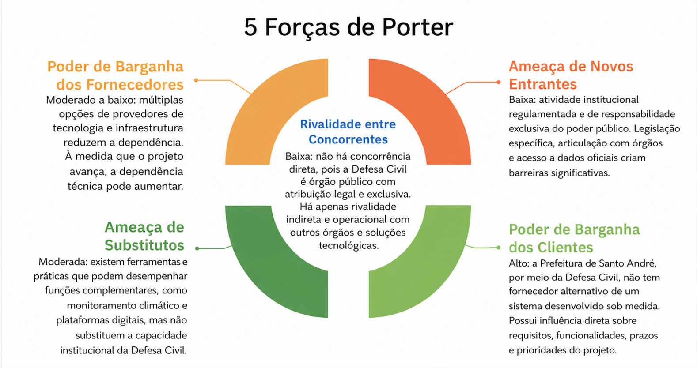
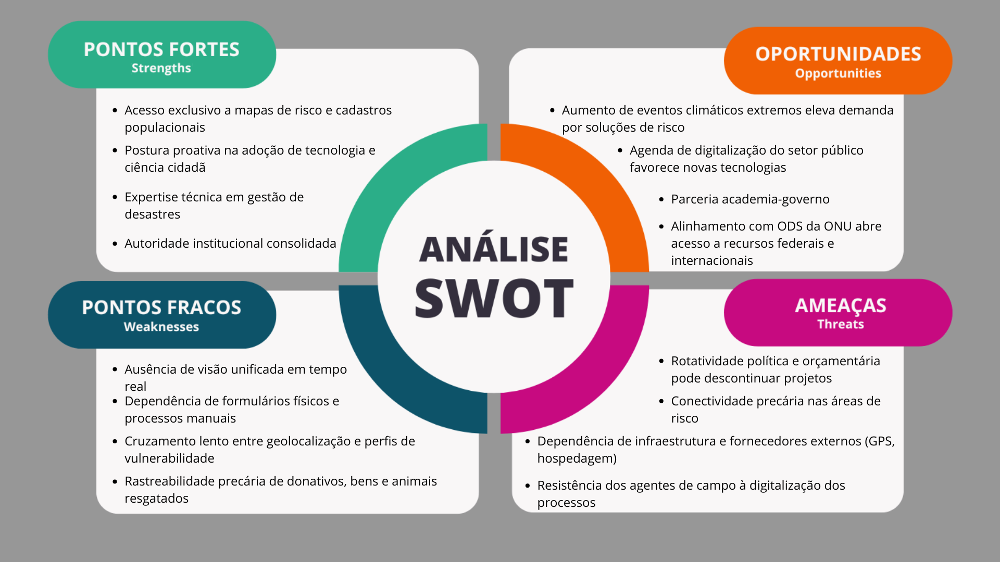
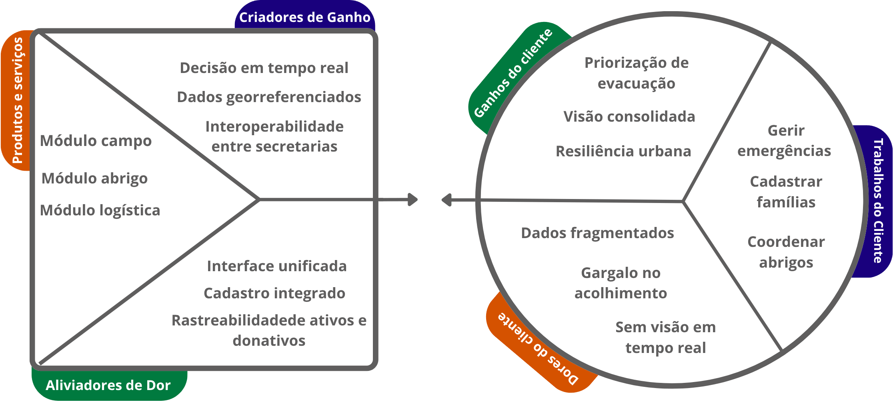
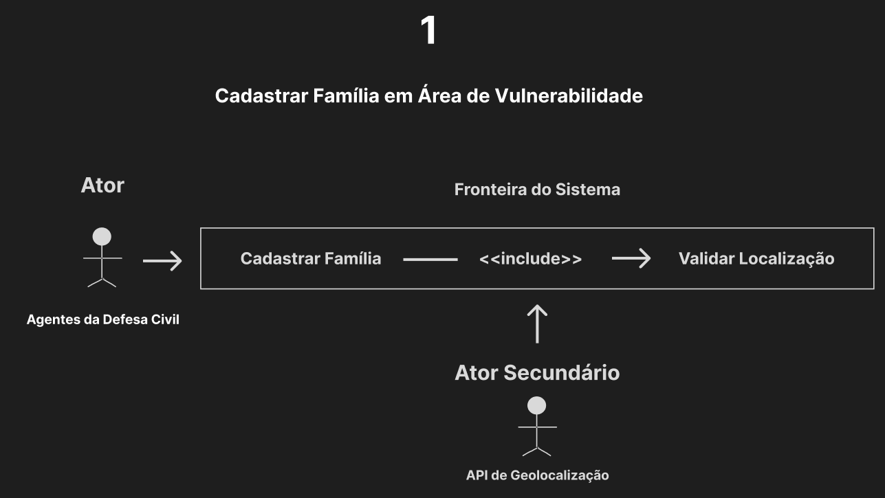
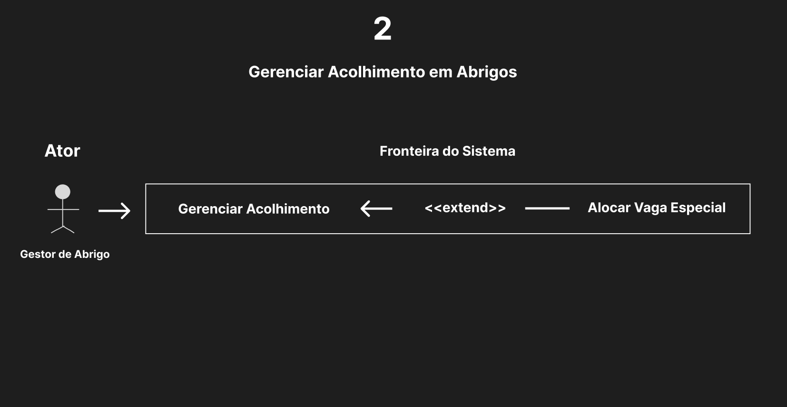
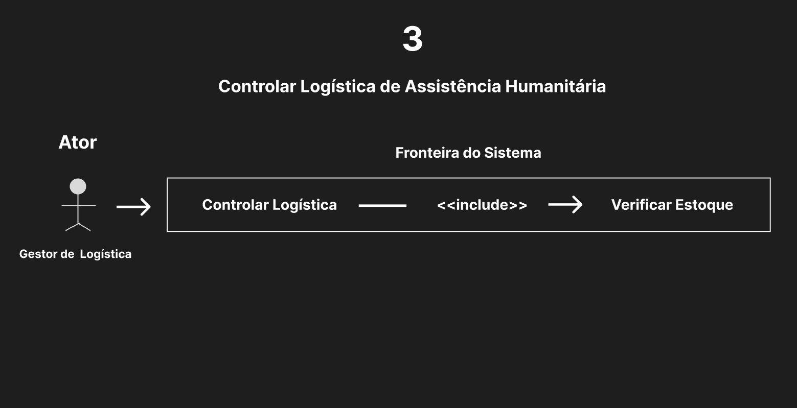
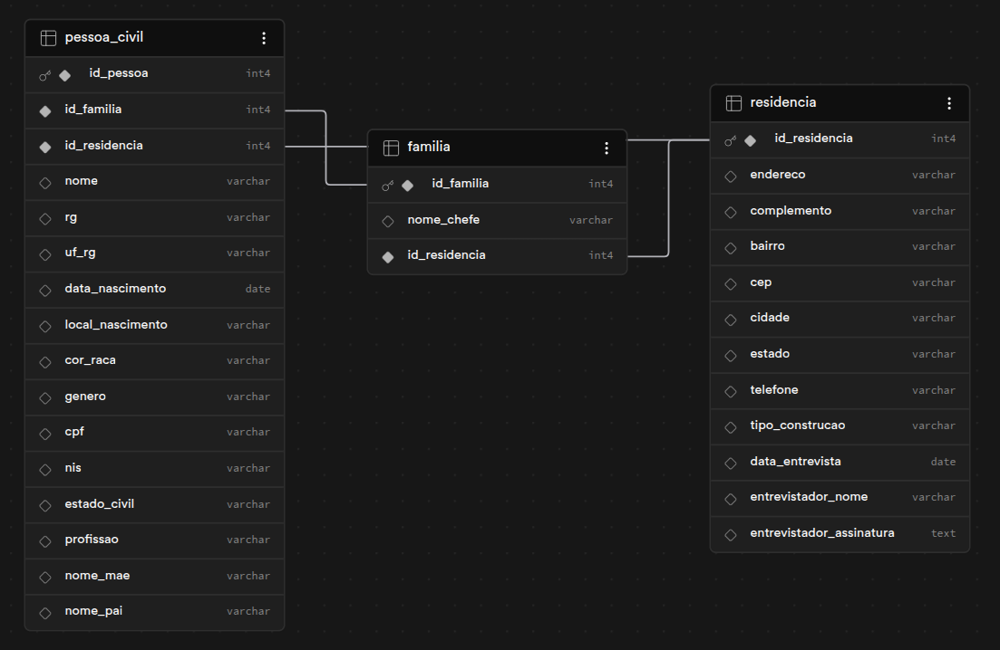

# WAD - Web Application Document - Módulo 2 - Inteli

**_Os trechos em itálico servem apenas como guia para o preenchimento da seção. Por esse motivo, não devem fazer parte da documentação final_**

## Nome do Grupo

#### Nomes dos integrantes do grupo

- <a href="https://www.linkedin.com/in/ricardo-nelken-77153a3a9/">Ricardo Nelken</a>
- <a href="https://www.linkedin.com/in/paulo-roberto-amorim/">Paulo Roberto Amorim de Sousa</a>
- <a href="https://www.linkedin.com/in/rodriguesgabrieleng/?locale=pt">Gabriel Rodrigues</a>
- <a href="https://www.linkedin.com/in/guilherme-d-elia-251855272/">Guilherme D'Elia</a>
- <a href="https://www.linkedin.com/in/isaac-nicolas-alves-da-silva-9787592a4/">Isaac Nicolas Alves da Silva</a>
- <a href="https://www.linkedin.com/in/lucaslevivaz/">Lucas Levi Vaz</a>
- <a href="https://www.linkedin.com/in/anita-fratelli-258398314/">Anita Fratelli</a>
- <a href="https://www.linkedin.com/in/gabrielly-mendes-bb94683b9/">Gabrielly Mendes</a>


## Sumário

[1. Introdução](#c1)

[2. Visão Geral da Aplicação Web](#c2)

[3. Projeto Técnico da Aplicação Web](#c3)

[4. Desenvolvimento da Aplicação Web](#c4)

[5. Testes da Aplicação Web](#c5)

[6. Estudo de Mercado e Plano de Marketing](#c6)

[7. Conclusões e trabalhos futuros](#c7)

[8. Referências](c#8)

[Anexos](#c9)

<br>

# <a name="c1"></a>1. Introdução 
A gestão de riscos e desastres em áreas urbanas constitui um desafio crescente, especialmente em função do aumento de eventos climáticos extremos e da presença de populações em situação de vulnerabilidade. Nesse contexto, a Defesa Civil de Santo André enfrenta dificuldades relacionadas à descentralização das informações, uma vez que dados sobre cadastro de famílias, acolhimento emergencial e logística humanitária encontram-se distribuídos em sistemas não integrados ou, em alguns casos, em registros físicos, comprometendo a eficiência das ações em situações de emergência.

Diante desse cenário, evidencia-se a necessidade de uma solução capaz de centralizar e integrar essas informações, contribuindo para a melhoria dos processos de gestão. O projeto GeoRisco Santo André propõe o desenvolvimento de uma aplicação web com recursos de georreferenciamento, voltada à consolidação de dados socioestruturais de áreas de risco, ao apoio à gestão do acolhimento emergencial e ao controle da logística de assistência humanitária.

A solução utiliza a tecnologia como ferramenta estratégica de apoio à tomada de decisão, permitindo a identificação de perfis de vulnerabilidade, a priorização de atendimentos e a otimização da alocação de recursos em contextos críticos. Além disso, busca promover a integração entre diferentes setores da administração pública, contribuindo para uma atuação mais coordenada e eficiente. Dessa forma, o projeto visa otimizar processos operacionais e fortalecer a capacidade de resposta do município, gerando valor público por meio da proteção de vidas e do aumento da resiliência urbana.

# <a name="c2"></a>2. Visão Geral da Aplicação Web

### 2.1.1. Modelo de 5 Forças de Porter 
O Modelo das 5 Forças de Porter é uma ferramenta estratégica utilizada para analisar a estrutura competitiva de um setor, permitindo compreender os fatores que influenciam a competitividade e a criação de valor de uma solução (Porter, 2008). No contexto do projeto GeoRisco Santo André, a aplicação desse modelo possibilita avaliar não apenas a concorrência direta, mas também a influência de substitutos, fornecedores, clientes e possíveis novos entrantes no desenvolvimento e adoção da solução.

Dessa forma, a análise das cinco forças contribui para identificar oportunidades e desafios no cenário da gestão pública de riscos, evidenciando como o projeto se posiciona estrategicamente diante das limitações atuais e das possibilidades de inovação no setor.

<div align="center">
  <p>Figura 01: 5 Forças de Porter</p>
  
  <p>Fonte: Material produzido pelos autores (2026)</p>
</div>

#### Análise da Ameaça de Novos Entrantes
 A ameaça de novos entrantes no contexto da atuação da Defesa Civil é considerada baixa, uma vez que se trata de uma atividade institucional regulamentada e de responsabilidade exclusiva do poder público (PORTER, 2008). A atuação em gestão de riscos e desastres é definida por legislações específicas, como a Política Nacional de Proteção e Defesa Civil, o que limita a entrada de novos agentes com a mesma função e autoridade. Além disso, a necessidade de articulação com diferentes órgãos governamentais e acesso a dados oficiais reforça essas barreiras. Dessa forma, embora possam surgir iniciativas privadas ou tecnológicas de apoio, estas não substituem o papel institucional da Defesa Civil, mantendo baixa a ameaça de novos entrantes (Prefeitura de Santo André, 2026; PORTER, 2008).
 
 #### Análise da Ameaça de Produtos ou Serviços Substitutos

 A ameaça de produtos ou serviços substitutos é considerada moderada, pois, embora não existam substitutos diretos para a atuação da Defesa Civil, algumas ferramentas e práticas podem desempenhar funções complementares ou parciais (PORTER, 2008). Entre elas, destacam-se sistemas privados de monitoramento climático, plataformas de geolocalização e ferramentas digitais de gestão de dados. No entanto, tais soluções não possuem a capacidade institucional, legal e operacional para coordenar ações emergenciais, acolhimento de famílias e articulação intersetorial. Assim, apesar de contribuírem para a gestão de riscos, esses substitutos não eliminam a necessidade da atuação da Defesa Civil, mantendo a ameaça em nível moderado (Prefeitura de Santo André, 2026; PORTER, 2008).

 #### Análise da Rivalidade entre Concorrentes

 A rivalidade entre concorrentes é considerada baixa no contexto tradicional de Porter, uma vez que a Defesa Civil não atua em um mercado competitivo, mas sim como órgão público com atribuição legal e responsabilidade exclusiva no âmbito municipal (PORTER, 2008). Não existem entidades privadas que disputem diretamente sua função institucional de coordenação de proteção e defesa civil.
 
 É importante ressaltar, porém, que por ser um órgão público que trabalha integrado com outros setores municipais, há uma forma indireta de rivalidade com outros órgãos governamentais que atuam em situações emergenciais, como o SAMU (Serviço de Atendimento Móvel de Urgência) que responde por emergências médicas, e a Polícia Militar que atua na segurança pública. Esses órgãos compartilham o mesmo espaço operacional durante crises e desastres, exigindo uma articulação clara de papéis e responsabilidades. Porém, essa "rivalidade" é apenas indireta e operacional, não competitiva, pois cada órgão possui funções complementares e bem definidas no protocolo de gestão de emergências.
 
 Adicionalmente, pode-se observar competição indireta com soluções tecnológicas privadas de monitoramento climático e geolocalização, bem como com sistemas desenvolvidos por outros municípios que implementam suas próprias abordagens para gestão de riscos. Ainda assim, essa concorrência é limitada, pois nenhuma solução privada ou externa substitui a autoridade legal, a responsabilidade institucional e a legitimidade operacional que a Defesa Civil possui. Dessa forma, reconhecendo a natureza pública e essencial da instituição, a análise de rivalidade reforça a necessidade de inovação interna e modernização dos processos, em vez de competição tradicional (Prefeitura de Santo André, 2026; PORTER, 2008).

#### Análise do Poder de Barganha dos Clientes

O poder de barganha dos clientes é considerado **alto**, porém com características distintas daquelas encontradas em mercados competitivos tradicionais (PORTER, 2008). No contexto público, o "cliente" é a própria Prefeitura de Santo André, por meio da Defesa Civil, que financia e utiliza a solução.

Essa dinâmica diferenciada decorre de alguns fatores: primeiro, não há fornecedor alternativo de um sistema de gestão integrada especificamente desenvolvido para a Defesa Civil de Santo André, concedendo ao cliente uma posição de influência direta sobre as funcionalidades, prazos e ajustes do projeto. Segundo, como representante do setor público, a instituição tem autoridade para definir mudanças de requisitos e prioridades conforme sua operação evolui. Terceiro, o projeto é desenvolvido especificamente sob demanda do cliente, resultando em alta customização e dependência de seu feedback para validação contínua.

Por outro lado, essa barganha não é predatória, pois a Defesa Civil está comprometida com o sucesso da solução e reconhece a importância da qualidade técnica e da sustentabilidade do projeto. Dessa forma, o alto poder de barganha é exercido de forma colaborativa e estratégica, visando a qualidade final da plataforma que serve ao interesse público de proteção à população.

#### Análise do Poder de Barganha dos Fornecedores

O poder de barganha dos fornecedores é considerado **moderado a baixo**, com particularidades importantes decorrentes da natureza pública e tecnológica do projeto (PORTER, 2008).

Os principais fornecedores do projeto são provedores de serviços tecnológicos e infraestrutura, destacando-se plataformas de computação em nuvem (Amazon Web Services, Google Cloud, Microsoft Azure), fornecedores de banco de dados, APIs de georreferenciamento e ferramentas de desenvolvimento de software. A existência de múltiplas opções no mercado em cada uma dessas categorias reduz significativamente a dependência de um único fornecedor, concedendo à equipe de desenvolvimento maior liberdade de escolha e negociação.

Por outro lado, à medida que o projeto avança e adota tecnologias mais específicas ou implementa integrações complexas com sistemas municipais, a dependência técnica de determinados fornecedores pode aumentar, elevando seu poder de barganha. Além disso, há considerar que como projeto público com orçamento limitado, há restrições quanto à adoção de soluções proprietárias caras, criando preferência por tecnologias open-source e soluções de baixo custo, o que amplia as opções disponíveis e mantém o poder dos fornecedores controlado.

Em resumo, a natureza modular e a disponibilidade de alternativas tecnológicas no mercado mantêm o poder dos fornecedores em nível moderado, permitindo à Defesa Civil preservar flexibilidade arquitetural e evitar lock-in tecnológico em sua solução de gestão de riscos.

### 2.1.2. Análise SWOT da Instituição Parceira

<div align="center">
  <p>Figura 02: Análise Swot</p>
  
  <p>Fonte: Material produzido pelos autores (2026)</p>
</div>

A análise evidenciou que a Defesa Civil de Santo André detém monopólio legal e vanguarda setorial, sem concorrentes diretos, embora dispute espaço indiretamente com plataformas privadas de geolocalização e monitoramento climático. Verificou-se que sua autoridade é sustentada por dados exclusivos e pela integração ao Consórcio Intermunicipal Grande ABC. Entretanto, constatou-se que a manutenção de processos manuais e a resistência à digitalização fragilizam a operação. Para assegurar a liderança estratégica frente aos eventos climáticos extremos, conclui-se que a modernização, impulsionada por projetos acadêmicos e alinhada aos ODS, é necessária na mitigação das vulnerabilidades estruturais.

### 2.1.3. Solução (sprints 1 a 5)

#### Problema a ser resolvido
A Defesa Civil de Santo André enfrenta dificuldades na organização e centralização dos registros de ocorrências e informações operacionais. Muitos dados ficam dispersos, dificultando consultas, acompanhamento histórico e a gestão eficiente das informações utilizadas pela equipe no dia a dia.

#### Dados disponíveis
As informações e dados serão fornecidas diretamente pela própria Defesa Civil de Santo André para utilização e organização dentro da plataforma.

#### Solução proposta
Desenvolvimento de uma plataforma integrada composta por três componentes principais:

1. **Banco de Dados Centralizado**: Sistema que armazena e organiza todos os cadastros de ocorrências e dados da Defesa Civil em um único repositório, garantindo integridade, confiabilidade e acesso em tempo real às informações.

2. **Formulário Digital**: Interface utilizada pelos agentes de campo para cadastrar ocorrências, informações de famílias, dados de vulnerabilidade e coordenadas GPS. Os dados preenchidos no formulário são automaticamente integrados e persistidos no banco de dados centralizado.

3. **Site Integrado**: Plataforma web para gestão e consulta dos dados, permitindo busca por nome, CPF ou setor de risco, filtros por perfil de vulnerabilidade, visualização clara de todos os cadastros e acesso de forma organizada e prática.

A integração entre esses componentes garante que os dados coletados em campo fluam automaticamente para o banco de dados centralizado e fiquem imediatamente disponíveis no site para consulta e gestão.

#### Forma de utilização da solução
Os agentes da Defesa Civil utilizarão o formulário digital em campo para cadastrar ocorrências, informações familiares e dados operacionais. Esses dados são automaticamente armazenados no banco de dados centralizado. Em seguida, na sede, gestores e administradores acessarão o site integrado para consultar, filtrar, atualizar informações e gerar relatórios, tendo uma visão consolidada e em tempo real de todas as ocorrências e cadastros registrados.

#### Benefícios esperados
A solução deve melhorar a organização das informações, facilitar consultas e otimizar o acompanhamento das ocorrências, permitindo maior eficiência operacional e mais agilidade no acesso às informações necessárias para o trabalho da Defesa Civil.

#### Critério de sucesso e como será avaliado
O sucesso será avaliado pela facilidade de uso da plataforma, organização dos registros,     melhoria na gestão das informações, por meio de feedback dos funcionários.


### 2.1.4. Value Proposition Canvas: 

O Canvas de Proposta de Valor é um modelo amplamente utilizado para conectar as necessidades reais dos clientes à solução oferecida. Ele é dividido em dois quadrantes: à esquerda, a proposta de valor da solução; à direita, o perfil do cliente suas dores, tarefas e ganhos esperados.

Abaixo, está apresentado o Canvas desenvolvido para o Departamento de Proteção e Defesa Civil de Santo André, representando como o GeoRisco Santo André se propõe a resolver os desafios de gestão de risco, acolhimento emergencial e logística humanitária. Em seguida, cada componente é descrito em detalhes.

<div align="center">
  <p>Figura 03: Value Proposition Canvas</p>
  
  <p>Fonte: Material produzido pelos autores (2026)</p>
</div>

### PERFIL DO CLIENTE

#### Trabalhos do Cliente

Gerir emergências: Coordenar toda a resposta a desastres naturais e tecnológicos no município de Santo André, acionando protocolos de evacuação, abrigo e assistência humanitária de forma ágil e organizada.

Cadastrar famílias: Registrar moradores de áreas de risco com dados socioestruturais completos, composição familiar, perfil de vulnerabilidade, doenças crônicas, animais de estimação e localização exata do imóvel.

#### Dores

Dados fragmentados: As informações de cadastro, abrigo e logística existem em papéis, planilhas e sistemas separados, sem integração. Isso torna impossível cruzar dados de geolocalização com perfis de vulnerabilidade no momento crítico da evacuação.

Sem visão em tempo real: A ausência de uma interface única impede que gestores vejam o cenário de crise consolidado, dificultando o planejamento preventivo e a tomada de decisão durante eventos extremos.

#### Ganhos

Priorização de evacuação: Com dados cruzados de geolocalização e perfil de vulnerabilidade, a Defesa Civil consegue identificar imediatamente quais famílias: Idosos, crianças, gestantes, PCDs devem ser atendidas primeiro nos protocolos de evacuação.

Visão consolidada: Todos os dados de campo, abrigo e logística acessíveis em uma única interface, permitindo que gestores acompanhem o cenário de crise em tempo real e ajustem recursos conforme a demanda evolui.

Resiliência urbana: A capacidade de resposta mais eficiente a desastres fortalece a cidade como um todo, reduzindo impactos humanos e patrimoniais e contribuindo diretamente com os objetivos da Agenda 2030 da ONU.


### PROPOSTA DE VALOR

#### Produtos e Serviços

 Módulo de campo: Aplicação otimizada para tablets e celulares usada pelos agentes em campo. Permite o cadastro completo de famílias com captura obrigatória de GPS, registro fotográfico do imóvel, identificação de vulnerabilidades e logística de emergência (animais, veículo, destino de evacuação).

 Painel: Interface desktop com pontos georreferenciados, filtros dinâmicos por setor de risco, bairro, idade e perfil de vulnerabilidade.

#### Aliviadores de Dor

Interface unificada: Substitui papéis, planilhas e sistemas isolados por uma única plataforma digital, eliminando a retrabalho e a perda de informação entre as etapas de campo, acolhimento e logística.

Cadastro integrado: O registro feito em campo alimenta automaticamente o módulo de abrigo e o painel de visualização, garantindo que todos os setores da Defesa Civil e secretarias parceiras trabalhem com os mesmos dados atualizados.

#### Criadores de Ganho

Decisão em tempo real: Com todos os dados centralizados e atualizados continuamente, gestores conseguem alocar equipes, redirecionar recursos e acionar protocolos com base em informações confiáveis e não em estimativas ou dados desatualizados.

Dados georreferenciados: A captura obrigatória de coordenadas GPS no momento do cadastro transforma cada família em um ponto no mapa, permitindo análise espacial de densidade de vulnerabilidade, planejamento de rotas de evacuação e identificação de áreas críticas por região.

### 2.1.5. Matriz de Riscos do Projeto

Nesta seção é apresentada a matriz de riscos do projeto de plataforma de gestão de riscos e desastres para a Defesa Civil de Santo André, desenvolvida com o objetivo de identificar, analisar e mitigar possíveis ameaças que possam impactar o desenvolvimento e a entrega da solução, bem como destacar oportunidades estratégicas associadas ao produto.

A análise considera não apenas aspectos técnicos do desenvolvimento da plataforma, mas também fatores relacionados à experiência dos agentes de campo, à credibilidade e confiabilidade das informações de risco, e ao alinhamento com os objetivos e requisitos da Defesa Civil de Santo André. Cada risco e oportunidade foi avaliado com base em sua probabilidade de ocorrência e impacto no projeto, sendo classificado qualitativamente como baixo, médio ou alto.

Essa abordagem permite priorizar ações de mitigação e potencialização, contribuindo para uma gestão mais eficiente do projeto ao longo das sprints.

### Ameaças

| ID  | Ameaça | Descrição | Probabilidade | Impacto | Justificativa da Pontuação | Ação de Mitigação |
|-----|--------|----------|---------------|---------|-----------------------------|-------------------|
| A01 | **Interface pouco intuitiva** | Compreensão difícil da View do site | Média | Alta | Probabilidade média pois depende de experiência do cliente com tecnologia, impacto alto pois afeta diretamente a experiência e tempo gasto | Ajustar duração com testes de usuário |
| A02 | **Confusão com tela inicial** | Usuário não compreende dinâmica, interface da tela inicial | Média | Alta | Muitos sites falham nisso, impacto alto pois define o usuário pode ficar insatisfeito com a perda de tempo | Testes de usabilidade e simplificação |
| A03 | **Queda do servidor** | Limitações de infraestrutura | Baixa | Alta | Baixa probabilidade por ser incomum a queda de um servidor estável, impacto alto pois é crítico o funcionamento | Ter um servidor estável |
| A04 | **Falta de acessibilidade** | Exclusão de parte dos usuários | Média | Média | Necessidade importante de inclusão, impacto relevante em inclusão | Aplicar princípios básicos de UX |
| A05 | **Baixa satisfação com o Design** | Visual, Áudio, Animação desagrádavel | Alta | Média | Alta probabilidade devido à subjetividade , Média importância com a satisfação do usuário | Adicionar visuais, sons, animações agrádaveis |
| A06 | **Falha de segurança** | Baixa proteção dos dados, processo de verificação | Média | Alta | Probabilidade média de acordo com as medidas estabelecidas, impacto alto por quebra de confiança com o usuário e empresa | Estabelecer diversas medidas de proteção de dados, segurança |
| A07 | **Atraso no projeto** | Entrega fora do prazo | Média | Alta | Comum em projetos de software, impacto alto para avaliação e cliente | Planejamento e acompanhamento |
| A08 | **Interpretação incorreta** | Usuário entende errado as possíveis interações | Alta | Alta | Alta probabilidade em sites B2B devido ao gasto de tempo, impacto direto no uso do site | Reforçar feedback interativo |
| A09 | **Bugs críticos** | Quebra da experiência do site | Alta | Alta | Muito comum em desenvolvimento, impacto direto na usabilidade | Testes frequentes |
| A10 | **Problemas com assets** | Questões visuais e de desempenho | Média | Média | Pode ocorrer mas é controlável, impacto moderado | Otimização e padronização |
| A11 | **Desalinhamento com Defesa Cívil** | Produto não atende expectativas | Média | Alta | Probabilidade média sem validação contínua, impacto alto no sucesso do projeto | Reuniões frequentes |
| A12 | **Baixa adesão do público** | Usuários não visualizam o uso do produto como ágradavel | Média | Alta | Público pode não buscar reutilizar o site, impacto alto na utilidade | Testes com usuários |
| A13 | **Conteúdo pouco confiável** | Informações superficiais ou inválidas | Baixa | Alta | Pode ser evitado, mas impacto alto na credibilidade | Revisão com fontes providas pela Defesa Cívil |
| A14 | **Falta de integração** | Dificuldade com canais da Defesa Cívil | Média | Média | Integração não é trivial, impacto moderado | Planejar integrações |
| A15 | **Valor pouco claro** | Usuário não entende o benefício | Média | Média | Comum em produtos novos, impacto médio | Melhorar comunicação |
| A16 | **Desalinhamento de objetivo** | Crescimento desordenado do projeto | Alta | Média | Muito comum em desenvolvimento, impacto médio pois afeta prazo | Definir escopo, objetivo claro |
| A17 | **Dependência da equipe** | Poucas pessoas concentram conhecimento | Média | Média | Probabilidade média, impacto moderado | Documentação e divisão de tarefas |

---

### Oportunidades

| ID | Oportunidade | Descrição | Probabilidade | Impacto | Justificativa da Pontuação | Ação de Potencialização |
|-----|-------------|-----------|---------------|---------|----------------------------|--------------------------|
| O01 | **Integração com alertas automáticos** | Enviar notificações automáticas para famílias em zonas de risco quando um evento climático for detectado. | Média | Alta | A análise de dados georreferenciados permite identificar áreas de maior vulnerabilidade; a integração com alertas meteorológicos pode ser explorada futuramente. | Prever na arquitetura uma camada de notificações e documentar a API que poderia ser integrada futuramente. |
| O02 | **Expansão para outros municípios** | Replicar a solução para outras prefeituras que enfrentam o mesmo problema de gestão de desastres. | Alta | Alta | O problema de dados fragmentados em emergências é universal no contexto municipal brasileiro. | Evitar hardcode de dados específicos de Santo André; documentar a arquitetura de forma parametrizável. |
| O03 | **Atualização em tempo real do mapa de calor** | O mapa seria atualizado automaticamente conforme novos cadastros são feitos em campo. | Alta | Alta | Agentes cadastrando em tempo real tornariam o painel muito mais útil durante uma crise ativa. | Implementar websockets ou polling para atualização automática do dashboard durante emergências. |
| O04 | **Módulo de histórico e evolução de risco** | Registrar como as zonas de risco evoluem ao longo do tempo, permitindo comparar situações antes e depois de intervenções. | Média | Alta | A Defesa Civil poderia usar esse histórico para embasar políticas públicas e relatórios governamentais. | Estruturar o banco de dados com timestamps em todos os registros desde o início para viabilizar análise histórica. |
| O05 | **Geração de relatórios automáticos para órgãos federais** | Exportar relatórios nos formatos exigidos pelo governo federal automaticamente, sem trabalho manual. | Média | Alta | Hoje esses relatórios são feitos manualmente; automatizar economizaria horas de trabalho da equipe. | Levantar com o parceiro os formatos obrigatórios de reporte e prever campos compatíveis desde o cadastro. |
| O06 | **Aplicativo móvel dedicado para agentes de campo** | Evoluir a interface mobile para um app nativo com funcionamento offline completo. | Média | Alta | Um app nativo lidaria melhor com conectividade intermitente em áreas de risco. | Desenvolver o front-end atual como PWA para facilitar a migração futura para app nativo. |
| O07 | **Integração com dados de saúde pública** | Cruzar os dados de vulnerabilidade do cadastro com informações do sistema de saúde municipal. | Baixa | Alta | Pessoas com doenças crônicas já são cadastradas; integrar com saúde tornaria a triagem mais assertiva. | Prever campos compatíveis com o prontuário SUAS e documentar os pontos de integração possíveis. |
| O08 | **Dashboard público de transparência** | Publicar versão simplificada e anonimizada do mapa para a população acompanhar a gestão de riscos. | Média | Média | Transparência em gestão de riscos aumenta engajamento comunitário e confiança na prefeitura. | Separar desde o início dados sensíveis dos dados agregados para viabilizar uma visão pública. |

### Critério de Priorização

A priorização dos riscos foi realizada com base na combinação entre probabilidade e impacto, considerando uma abordagem qualitativa. Riscos com alta probabilidade e alto impacto são tratados como críticos e recebem maior atenção no planejamento e nas ações de mitigação.

Já riscos com impacto elevado, mesmo que com menor probabilidade, também são considerados prioritários devido ao seu potencial de comprometer os objetivos do projeto, especialmente no que diz respeito à confiabilidade da informação, à experiência operacional dos agentes de campo e ao cumprimento dos requisitos da Defesa Civil de Santo André.

No caso das oportunidades, aquelas com alta probabilidade e alto impacto são priorizadas como estratégicas, devendo ser exploradas ativamente ao longo do desenvolvimento. O foco está em maximizar o valor entregue tanto para os usuários finais (agentes e gestores da Defesa Civil) quanto para a instituição parceira, garantindo que o projeto não apenas funcione tecnicamente, mas também gere impacto real na gestão de riscos de desastres naturais e na proteção da população de Santo André.

## 2.2. Personas (sprint 1)

### Persona 1: O Agente de Campo
**Info Demográfica:** Josias, 34 anos

<div align="center">
  <p>Figura 04: Persona - Josias</p>
  
  <p>Fonte: Imagem criada via IA (2026)</p>
</div>

**Contexto:** Atua presencialmente na linha de frente das áreas de risco de Santo André (encostas, áreas de alagamento e ocupações). Atualmente, faz o cadastro das populações vulneráveis utilizando papel e prancheta, muitas vezes enfrentando condições climáticas adversas, terrenos irregulares e conexão de internet móvel intermitente.

### Dores
1. Fazer o cadastro no papel é ineficaz e arriscado; os documentos físicos estão sujeitos a danos (chuva, umidade, perda) e a busca manual por essas fichas posteriormente é extremamente demorada.
2. O preenchimento manual de formulários extensos gera fadiga e lentidão, impactando diretamente na quantidade de famílias que ele consegue atender e mapear por dia.
3. Em ocupações irregulares, muitas moradias não possuem nome de rua oficial, número ou CEP, o que impossibilita o registro exato de onde a família reside através dos métodos tradicionais.
4. O medo de perder o trabalho feito caso a internet móvel oscile ou caia no meio de um atendimento digital.

### Necessidades
1. Uma ferramenta digital para realizar os cadastros com um fluxo simples, direto e com botões de fácil acesso, minimizando a digitação excessiva em campo.
2. Uma forma de registrar com precisão a localização da moradia da família em tempo real, sem depender de um endereço formal, rua ou CEP.
3. Garantia de que o sistema funcionará e guardará as informações coletadas mesmo quando ele estiver em um "ponto cego" de sinal de internet.

### Solução
Uma interface web focada na usabilidade móvel que possibilita que os cadastros sejam realizados de maneira ágil, substituindo o papel por formulários digitais de preenchimento rápido. Para contornar a falta de endereços formais, a interface utiliza o georreferenciamento nativo do dispositivo para capturar automaticamente as coordenadas exatas (latitude e longitude) do local no momento do cadastro. Além disso, a aplicação conta com resiliência offline, utilizando o armazenamento local do navegador para guardar os dados temporariamente caso a conexão caia, sincronizando tudo com o banco de dados centralizado assim que o sinal de internet for restabelecido. Isso garante a segurança do dado coletado e facilita a localização rápida de qualquer pessoa atingida.

### Persona 2: A Gestora Administrativa

**Info Demográfica:** Cláudia, 41 anos

<div align="center">
  <p>Figura 04: Persona - Cláudia</p>
  
  <p>Fonte: Imagem criada via IA (2026)</p>
</div>

**Contexto:** Trabalha na sede da Defesa Civil de Santo André, coordenando o fluxo de informações entre os agentes de campo, as secretarias e a diretoria. Não vai a campo, sua atuação é inteiramente baseada nos dados que chegam até ela, e é responsável por gerar relatórios, tomar decisões operacionais e responder a demandas da gestão municipal.

#### Dores

1. As informações chegam fragmentadas trazidas pelos agentes em papel, parte em planilhas.
2. Quando uma autoridade ou secretaria pede um número ("quantas famílias em risco alto têm idosos no setor B?"), Cláudia precisa garimpar manualmente em múltiplas fontes para responder, o que pode levar horas ou dias.
3. Sem dados organizados, as decisões de alocação de recursos (onde mandar agentes, quais abrigos acionar, quais donativos priorizar) são tomadas com base na experiência e intuição, não em evidências.
4. É impossível saber em tempo real quantas pessoas já foram cadastradas, quais regiões ainda não foram visitadas ou quais famílias estão com cadastro incompleto.
5. A cada nova emergência, o histórico de cadastros anteriores se perde ou fica inacessível, obrigando o time a recomeçar do zero.
6. De forma geral, não há uma visão clara e confiável do que está acontecendo em campo.

#### Necessidades

1. Todos os dados cadastrados pelos agentes de campo centralizados em um único lugar, atualizados em tempo real, sem depender de repasse manual.
2. Filtros que permitam segmentar os cadastros por setor de risco, bairro, perfil de vulnerabilidade (idosos, PCDs, gestantes) e status do cadastro, de forma rápida e sem precisar de apoio técnico.
3. Uma ferramenta visual que transforme os dados em informação acionável: quantas famílias, onde estão, qual o nível de risco, quem tem prioridade de evacuação.
4. Poder exportar relatórios prontos para apresentar à diretoria ou às secretarias parceiras, sem precisar montar planilhas manualmente.
5. Rastrear a completude dos cadastros, saber quais famílias têm dados faltando para acionar os agentes certos.

#### Solução

Um banco de dados centralizado que reúne todos os cadastros feitos pelos agentes de campo em um único lugar, estruturado de forma que Cláudia consiga buscar, filtrar e consultar qualquer informação em segundos (por nome, CPF, setor de risco, bairro ou perfil de vulnerabilidade) sem precisar garimpar planilhas ou esperar repasse manual. A base de dados garante que nenhuma informação se perca e que todos os cadastros sigam um padrão único, confiável e consultável a qualquer momento. Futuramente, essa mesma base poderá alimentar dashboards visuais, gráficos de distribuição de risco, tabelas de prioridade de evacuação e relatórios automáticos para a diretoria e as secretarias parceiras.

## 2.3. User Stories

As *User Stories* são descrições concisas e em linguagem simples de uma funcionalidade do sistema, contadas a partir da perspectiva de quem executará a ação. Elas têm como objetivo principal focar no valor que a funcionalidade entrega ao negócio, facilitando a comunicação entre a equipe de desenvolvimento e os stakeholders, e servindo como um guia claro para a implementação.

Para garantir a qualidade, as histórias deste documento foram validadas utilizando o acrônimo INVEST (Independentes, Negociáveis, Valorosas, Estimáveis, Pequenas/Small e Testáveis) e possuem Critérios de Aceite.

**Nota sobre a Priorização:** A ordem de prioridade (Alta, Média e Baixa) foi definida com base no impacto direto para a operação e em dependências lógicas. As histórias de **Alta prioridade (US01 a US05)** compõem o *core* do sistema, garantindo a entrada correta, única e georreferenciada dos dados em campo. As histórias de **Média prioridade (US06 a US09)** focam na usabilidade, segurança e manipulação desses dados pela gestão. Por fim, a história de **Baixa prioridade (US10)** representa uma funcionalidade acessória de monitoramento.

| Prioridade | ID | Resumo |
|------------|----|--------|
| Alta | US01 | Cadastrar indivíduos com dados biográficos |
| Alta | US02 | Impedir cadastros duplicados por CPF/NIS |
| Alta | US03 | Registrar localização via GPS |
| Alta | US04 | Registrar dados de vulnerabilidade |
| Alta | US05 | Visualizar distribuição geográfica em mapa |
| Média | US06 | Salvar cadastros parciais automaticamente |
| Média | US07 | Buscar e filtrar cadastros por múltiplos critérios |
| Média | US08 | Visualizar cadastro com segurança de acesso |
| Média | US09 | Exportar dados em formato estruturado |
| Baixa | US10 | Acompanhar status de completude dos cadastros |

---

### US01

| Identificação | US01 |
|---|---|
| Persona | Josias (Agente de Campo) |
| User Story | Como agente de campo, posso cadastrar indivíduos com seus dados biográficos e socioeconômicos, para garantir que as informações sejam coletadas diretamente na fonte de forma estruturada |
| Critério de aceite 1 | CR1: Dado que o agente acessa o formulário de cadastro, quando preencher todos os campos obrigatórios válidos e submeter, então o sistema deve persistir o registro com ID único e retornar confirmação de sucesso |
| Critério de aceite 2 | CR2: Dado que o agente insere uma data de nascimento futura, quando tentar salvar o cadastro, então o sistema deve bloquear a ação e exibir mensagem de erro em até 500ms |
| Critério de aceite 3 | CR3: Dado que o agente insere um CPF inválido, quando submeter o formulário, então o sistema deve validar o dígito verificador e impedir o salvamento |
| Critério de aceite 4 | CR4: Dado que o agente preenche o nome com acentuação, quando salvar, então o sistema deve armazenar o nome em caixa alta e sem acentos |
| Critérios INVEST | Independente: A história foi estruturada de forma desacoplada de outras funcionalidades centrais. <br>Negociável: A forma de persistência e validação poderá ser ajustada conforme arquitetura. <br>Valorosa: Foi identificado alto valor na coleta estruturada de dados na origem. <br>Estimável: A complexidade foi considerada mensurável com base em formulários e validações padrão. <br>Pequena: O escopo foi limitado ao cadastro inicial de indivíduos. <br>Testável: Os critérios foram definidos com cenários claros de validação e erro. |

---

### US02

| Identificação | US02 |
|---|---|
| Persona | Josias (Agente de Campo) |
| User Story | Como agente de campo, posso validar a unicidade por CPF ou NIS durante o registro, para evitar inconsistência nos dados coletados |
| Critério de aceite 1 | CR1: Dado que um CPF já está cadastrado como ativo, quando tentar registrar um novo indivíduo com o mesmo CPF, então o sistema deve bloquear o cadastro e informar duplicidade |
| Critério de aceite 2 | CR2: Dado que um cadastro foi inativado, quando um novo cadastro com o mesmo CPF for realizado, então o sistema deve permitir a criação |
| Critério de aceite 3 | CR3: Dado que o agente insere CPF ou NIS com formatação (pontos ou traços), quando o sistema processar o cadastro, então deve normalizar os dados e validar considerando apenas os dígitos |
| Critérios INVEST | Independente: A funcionalidade foi definida sem dependência direta de outras histórias. <br>Negociável: A lógica de comparação poderá ser ajustada para diferentes chaves únicas. <br>Valorosa: Foi identificado valor crítico na integridade e unicidade dos dados. <br>Estimável: A implementação foi considerada clara com validações conhecidas. <br>Pequena: O escopo foi restrito à verificação de duplicidade. <br>Testável: Os cenários de bloqueio e permissão foram explicitamente definidos. |

---

### US03

| Identificação | US03 |
|---|---|
| Persona | Josias (Agente de Campo) |
| User Story | Como agente de campo, posso registrar a localização da residência por meio de coordenadas GPS, para identificar corretamente a moradia mesmo em locais sem endereço formal |
| Critério de aceite 1 | CR1: Dado que o agente acessa o formulário em campo, quando iniciar o cadastro, então o sistema deve capturar automaticamente latitude e longitude via GPS |
| Critério de aceite 2 | CR2: Dado que o dispositivo não possui sinal de GPS ativo, quando o agente tentar capturar a localização, então o sistema deve solicitar a ativação do serviço |
| Critério de aceite 3 | CR3: Dado que a localização foi capturada, quando o cadastro for salvo, então as coordenadas devem ser armazenadas junto ao registro |
| Critérios INVEST | Independente: A funcionalidade foi estruturada sem dependência direta de outras histórias. <br>Negociável: A forma de captura (automática ou manual) pode ser ajustada. <br>Valorosa: Foi identificado valor na precisão da localização em áreas irregulares. <br>Estimável: A implementação foi considerada previsível com uso de APIs de geolocalização. <br>Pequena: O escopo foi limitado ao registro de coordenadas. <br>Testável: Os critérios permitem validação da captura e persistência da localização. |

---

### US04

| Identificação | US04 |
|---|---|
| Persona | Josias (Agente de Campo) |
| User Story | Como agente de campo, posso registrar informações de vulnerabilidade dos indivíduos, para permitir a priorização de atendimento em situações de risco |
| Critério de aceite 1 | CR1: Dado que o agente preenche o cadastro, quando informar idade, deficiência ou condição especial, então o sistema deve classificar automaticamente o nível de vulnerabilidade |
| Critério de aceite 2 | CR2: Dado que os dados de vulnerabilidade foram registrados, quando o cadastro for salvo, então o sistema deve vincular essa informação ao perfil do indivíduo |
| Critério de aceite 3 | CR3: Dado que os critérios de vulnerabilidade não forem atendidos, quando o cadastro for salvo, então o sistema deve classificar como baixa prioridade |
| Critérios INVEST | Independente: A funcionalidade foi definida sem dependência de módulos externos. <br>Negociável: Os critérios de classificação de vulnerabilidade podem ser ajustados. <br>Valorosa: Foi identificado valor na priorização de indivíduos em situação de risco. <br>Estimável: A implementação foi considerada clara com base em regras de negócio definidas. <br>Pequena: O escopo foi limitado ao registro e classificação de vulnerabilidade. <br>Testável: Os critérios permitem validar a correta classificação com base nos dados inseridos. |

---

### US05

| Identificação | US05 |
|---|---|
| Persona | Cláudia (Gestora Administrativa) |
| User Story | Como gestora administrativa, posso visualizar a distribuição geográfica dos cadastros em um mapa, para identificar áreas com maior concentração de vulnerabilidade |
| Critério de aceite 1 | CR1: Dado que a gestora acessa o painel, quando visualizar o mapa, então os cadastros devem ser exibidos como pontos georreferenciados |
| Critério de aceite 2 | CR2: Dado que existem múltiplos registros próximos, quando o mapa for exibido, então o sistema deve agrupar os pontos (clusters) para melhor visualização |
| Critério de aceite 3 | CR3: Dado que a gestora seleciona uma região no mapa, quando interagir com os dados, então o sistema deve exibir informações resumidas daquela área |
| Critérios INVEST | Independente: A funcionalidade foi projetada separadamente da coleta de dados. <br>Negociável: A forma de visualização no mapa pode ser ajustada (clusters, heatmap, etc.). <br>Valorosa: Foi identificado valor na visualização estratégica das áreas de risco. <br>Estimável: A complexidade foi considerada controlável com bibliotecas de mapas. <br>Pequena: O escopo foi limitado à exibição dos dados georreferenciados. <br>Testável: Os critérios permitem validar renderização, agrupamento e interação com os dados. |

---

### US06

| Identificação | US06 |
|---|---|
| Persona | Josias (Agente de Campo) |
| User Story | Como agente de campo, posso salvar cadastros parciais automaticamente, para não perder dados em caso de falha de conexão ou interrupção |
| Critério de aceite 1 | CR1: Dado que o agente está preenchendo o formulário, quando houver intervalo de 30 segundos, então o sistema deve salvar automaticamente o rascunho |
| Critério de aceite 2 | CR2: Dado que a conexão é perdida durante o cadastro, quando o agente retornar ao sistema, então os dados previamente inseridos devem ser recuperados |
| Critério de aceite 3 | CR3: Dado que o cadastro está incompleto, quando salvo, então o sistema deve marcar o status como "Incompleto" |
| Critério de aceite 4 | CR4: Dado que o usuário fecha o navegador inesperadamente, quando reabrir o sistema, então o rascunho deve estar disponível para continuidade |
| Critério de aceite 5 | CR5: Dado que a conexão é restabelecida, quando houver dados pendentes, então o sistema deve sincronizar automaticamente com o servidor |
| Critérios INVEST | Independente: A funcionalidade foi isolada da persistência definitiva. <br>Negociável: A estratégia de armazenamento local poderá ser alterada. <br>Valorosa: Foi identificado valor na confiabilidade e continuidade do trabalho em campo. <br>Estimável: A complexidade foi considerada moderada e mensurável. <br>Pequena: O escopo foi focado em autosave e recuperação. <br>Testável: Os cenários de perda e recuperação foram claramente definidos. |

---

### US07

| Identificação | US07 |
|---|---|
| Persona | Cláudia (Gestora Administrativa) |
| User Story | Como gestora administrativa, posso buscar e filtrar cadastros por múltiplos critérios, para obter informações rapidamente e tomar decisões baseadas em dados |
| Critério de aceite 1 | CR1: Dado que a gestora acessa a base de dados, quando aplicar filtros por nome, CPF ou bairro, então o sistema deve retornar os registros correspondentes em até 5 segundos |
| Critério de aceite 2 | CR2: Dado que a gestora realiza busca com variação de acentuação, quando pesquisar um nome, então o sistema deve retornar resultados foneticamente similares |
| Critério de aceite 3 | CR3: Dado que a gestora filtra por vulnerabilidade, quando aplicar o critério, então o sistema deve considerar renda per capita conforme regra definida |
| Critério de aceite 4 | CR4: Dado que múltiplos filtros são aplicados simultaneamente, quando executada a busca, então o sistema deve combinar corretamente os critérios |
| Critérios INVEST | Independente: A funcionalidade foi projetada sem dependência de outras consultas específicas. <br>Negociável: Os critérios de filtro poderão ser expandidos ou refinados. <br>Valorosa: Foi identificado valor direto na tomada de decisão operacional. <br>Estimável: A implementação foi considerada previsível com uso de índices e queries. <br>Pequena: O escopo foi limitado à busca e filtragem. <br>Testável: Os critérios foram definidos com métricas de desempenho e precisão. |

---

### US08

| Identificação | US08 |
|---|---|
| Persona | Cláudia (Gestora Administrativa) |
| User Story | Como gestora administrativa, posso visualizar os dados completos de um cadastro com segurança de acesso, para garantir análise detalhada sem violar a privacidade |
| Critério de aceite 1 | CR1: Dado que a gestora acessa um registro, quando possuir permissão adequada, então todos os dados devem ser exibidos corretamente |
| Critério de aceite 2 | CR2: Dado que um usuário sem permissão tenta acessar dados sensíveis, quando visualizar o cadastro, então os campos restritos devem ser ocultados |
| Critério de aceite 3 | CR3: Dado que um dado sensível é acessado, quando a visualização ocorre, então o sistema deve registrar log com ID do usuário e timestamp |
| Critérios INVEST | Independente: A história foi definida de forma isolada da edição de dados. <br>Negociável: As regras de acesso poderão ser refinadas conforme perfis. <br>Valorosa: Foi identificado valor na segurança e governança dos dados. <br>Estimável: A complexidade foi considerada controlável com RBAC. <br>Pequena: O escopo foi restrito à visualização segura. <br>Testável: Os critérios foram definidos com cenários de acesso permitido e negado. |

---

### US09

| Identificação | US09 |
|---|---|
| Persona | Cláudia (Gestora Administrativa) |
| User Story | Como gestora administrativa, posso exportar os dados cadastrados em formato estruturado, para gerar relatórios e compartilhar informações com outras áreas |
| Critério de aceite 1 | CR1: Dado que a gestora seleciona os registros, quando solicitar exportação, então o sistema deve gerar arquivo em formato CSV ou PDF |
| Critério de aceite 2 | CR2: Dado que filtros estão aplicados, quando exportar os dados, então o arquivo deve conter apenas os registros filtrados |
| Critério de aceite 3 | CR3: Dado que o arquivo é gerado, quando concluída a exportação, então o sistema deve disponibilizar download imediato |
| Critérios INVEST | Independente: A funcionalidade foi definida sem dependência direta da visualização dos dados. <br>Negociável: Os formatos de exportação podem ser ajustados conforme necessidade. <br>Valorosa: Foi identificado valor na geração de relatórios para tomada de decisão. <br>Estimável: A implementação foi considerada previsível com geração de arquivos estruturados. <br>Pequena: O escopo foi limitado à exportação de dados filtrados. <br>Testável: Os critérios permitem validar geração e conteúdo do arquivo exportado. |

---

### US10

| Identificação | US10 |
|---|---|
| Persona | Cláudia (Gestora Administrativa) |
| User Story | Como gestora administrativa, posso acompanhar o status de completude dos cadastros, para identificar registros incompletos e direcionar ações de correção |
| Critério de aceite 1 | CR1: Dado que existem cadastros no sistema, quando acessados pela gestora, então cada registro deve indicar seu status (completo ou incompleto) |
| Critério de aceite 2 | CR2: Dado que a gestora aplica filtro por status, quando selecionar “incompleto”, então o sistema deve listar apenas os registros pendentes |
| Critério de aceite 3 | CR3: Dado que um cadastro é atualizado, quando todos os campos obrigatórios forem preenchidos, então o status deve ser alterado automaticamente para “completo” |
| Critérios INVEST | Independente: A funcionalidade foi estruturada de forma isolada da edição de cadastros. <br>Negociável: Os critérios de completude podem ser refinados conforme regras futuras. <br>Valorosa: Foi identificado valor na melhoria da qualidade e confiabilidade dos dados. <br>Estimável: A complexidade foi considerada baixa com base em validações existentes. <br>Pequena: O escopo foi limitado ao status de completude dos registros. <br>Testável: Os critérios permitem validar a transição de status conforme o preenchimento de campos. |

# <a name="c3"></a>3. Projeto da Aplicação Web (sprints 1 a 5)

## 3.1. Requisitos do Sistema (sprints 1 a 5)

*Esta seção formaliza o que o sistema deve fazer, sob quais regras e com quais qualidades. Atualize a cada sprint conforme os requisitos evoluem.*

### 3.1.1. Requisitos Funcionais (sprint 1, refinar até sprint 5)

| ID    | Descrição | Prioridade | Status       |
|-------|-----------|------------|--------------|
| RF001 | **Cadastro de Indivíduos:** Permitir o registro de pessoas com campos biográficos e socioeconômicos. | Alta | Planejado |
| RF002 | **Verificação de Duplicidade:** Impedir registros duplicados via back-end comparando chaves únicas (ex: CPF ou NIS). | Alta | Planejado |
| RF003 | **Atualização de Dados:** Permitir a edição de informações de um cadastro já existente via ID único. | Alta | Planejado |
| RF004 | **Visualização Detalhada:** Retornar todos os dados e metadados vinculados a um registro selecionado. | Alta | Planejado |
| RF005 | **Busca e Filtros:** Localizar registros por meio de filtros como nome, documento ou status de vulnerabilidade. | Alta | Planejado |
| RF006 | **Inativação (Soft Delete):** Desativar um cadastro (flag active: false) sem removê-lo fisicamente do banco de dados. | Média | Planejado |
| RF007 | **Exclusão Definitiva (Hard Delete):** Remoção física e permanente de registros para conformidade estrita com a LGPD. | Média | Planejado |
| RF008 | **Auditoria (Logs):** Registrar quem criou, editou ou visualizou cada dado, com timestamp e ID do operador | Alta | Planejado |
| RF009 | **Anonimização de Dados:** Gerar bases de dados sem identificação nominal para criação de dashboards e estatísticas. | Média | Planejado |
| RF010 | **Controle de Acesso (RBAC):** Restringir o acesso a endpoints e campos sensíveis com base no perfil do usuário logado. | Alta | Planejado |
| RF011 | **Sanitização/Padronização:** Normalizar inputs (remover máscaras de telefone, CPF, etc.) antes da persistência no banco. | Média | Planejado |
| RF012 | **Gestão de Completude:** Permitir salvar cadastros parciais, sinalizando registros com campos obrigatórios pendentes. | Média | Planejado |
| RF013 | **Vínculo Familiar:** Agrupar diferentes registros de indivíduos sob um mesmo código ou UUID de núcleo familiar. | Alta | Planejado |
| RF014 | **Gestão de Documentos:** Permitir o upload e vinculação de arquivos (fotos/PDFs/comprovantes) ao registro do indivíduo. | Média | Planejado |
| RF015 | **Busca por Semelhança (Fuzzy):** Tratar acentuação e caracteres especiais nas buscas para garantir o retorno de nomes similares. | Baixa | Planejado |

### 3.1.2. Regras de Negócio (sprint 1, refinar até sprint 5)

| ID | Descrição da Regra de Negócio | Prioridade | RF Associado |
|:---|:---|:---:|:---|
| RN001 | **Unicidade de Identificação:** Não será permitido o cadastro de dois indivíduos com o mesmo número de CPF ou NIS ativos. | Alta | RF002 |
| RN002 | **Maioridade para Responsável:** Apenas indivíduos com idade igual ou superior a 18 anos podem ser vinculados como "Responsável Familiar". | Alta | RF013 |
| RN003 | **Imutabilidade de Logs:** Registros de auditoria não podem ser editados ou excluídos sob nenhuma circunstância. | Alta | RF008 |
| RN004 | **Formato de Documentos:** O sistema deve aceitar apenas arquivos nos formatos PDF, JPG e PNG para uploads. | Média | RF014 |
| RN005 | **Privacidade de Dados Sensíveis:** Campos de renda e saúde só devem ser visíveis para perfis autorizados (ex: Assistente Social). | Alta | RF010 |
| RN006 | **Limite de Tamanho de Arquivo:** Cada documento anexado ao cadastro não pode exceder o tamanho máximo de 5MB. | Média | RF014 |
| RN007 | **Inativação por Óbito:** Ao registrar óbito, o sistema deve encerrar automaticamente o vínculo do indivíduo no núcleo familiar. | Alta | RF006, RF013 |
| RN008 | **Padronização de Strings:** Nomes de indivíduos devem ser salvos em CAIXA ALTA e sem acentuação para facilitar buscas. | Média | RF011 |
| RN009 | **Persistência Limpa:** Números de documentos devem ser gravados apenas como dígitos numéricos (sem pontos ou traços). | Média | RF011 |
| RN010 | **Justificativa de Exclusão:** Toda exclusão definitiva (Hard Delete) exige uma justificativa textual e senha de supervisor. | Alta | RF007 |
| RN011 | **Status de Cadastro Pendente:** Registros sem documento de identificação ou endereço devem ter o status "Incompleto". | Média | RF012 |
| RN012 | **Vínculo Familiar Único:** Um indivíduo não pode pertencer a dois núcleos familiares distintos simultaneamente. | Alta | RF013 |
| RN013 | **Retenção de Logs:** Logs de visualização de dados sensíveis devem ser mantidos por no mínimo 5 anos. | Média | RF008 |
| RN014 | **Anonimização Irreversível:** Dados nominais em bases estatísticas devem ser substituídos por hashes irreversíveis. | Alta | RF009 |
| RN015 | **Bloqueio em Auditoria:** Registros sob processo de auditoria ficam bloqueados para edição até a liberação do revisor. | Baixa | RF003, RF008 |
| RN016 | **Cálculo de Vulnerabilidade:** O status de vulnerabilidade deve considerar renda per capita familiar inferior ao limite legal. | Alta | RF005 |
| RN017 | **Validação de CPF:** O sistema deve validar matematicamente o dígito verificador do CPF antes de salvar. | Alta | RF001, RF002 |
| RN018 | **Busca Fonética:** A busca por semelhança deve retornar resultados foneticamente próximos (ex: Luiz e Luís). | Baixa | RF015 |
| RN019 | **Alerta de Acesso:** Gerar log de alerta sempre que um usuário comum visualizar dados socioeconômicos restritos. | Média | RF004, RF008 |
| RN020 | **Validação Cronológica:** O sistema deve impedir o registro de datas de nascimento futuras em relação à data atual. | Alta | RF001 |

### 3.1.3. Requisitos Não Funcionais — 8 Eixos ISO/IEC 25010 (sprints 1 a 5)

| Eixo                     | Requisito | Métrica / Critério | Como atendido |
|--------------------------|-----------|--------------------|---------------|
| **USAB — Usabilidade** | O formulário de cadastro em campo deve ser operável com uma mão, em tela de no mínimo 5 polegadas, sem necessidade de scroll excessivo. | Máximo de 5 campos por tela; botões com altura mínima de 48px. | Interface mobile-first com stepper por etapas, campos agrupados por tema (dados pessoais, saúde, imóvel). |
| **USAB — Usabilidade** | O sistema deve fornecer feedback visual imediato para erros de validação nos formulários. | Mensagem de erro exibida em menos de 500ms após submissão inválida. | Validação client-side com highlight no campo inválido e mensagem descritiva abaixo do input. |
| **CONF — Confiabilidade** | O sistema deve manter os dados inseridos em campo mesmo em caso de perda de conexão. | Zero perda de dados em sessões com queda de rede; sincronização automática ao reconectar. | Armazenamento local temporário (localStorage ou IndexedDB) com fila de sincronização ao restabelecer conexão. |
| **CONF — Confiabilidade** | Cadastros parciais (RF012) devem ser recuperáveis após fechamento acidental do navegador. | Rascunho salvo automaticamente a cada 30 segundos. | Auto-save periódico vinculado ao ID da sessão, com indicador visual de "salvo". |
| **DES — Desempenho** | O carregamento inicial do formulário de campo deve ser rápido mesmo em redes 3G. | p95 < 5s em conexão simulada de 3G (1,6 Mbps). | Assets otimizados (lazy loading, compressão de imagens), bundle JS minificado. |
| **DES — Desempenho** | O mapa de calor deve renderizar os pontos georreferenciados sem travar a interface. | p95 < 5s para renderização de até 1.000 pontos simultâneos no mapa. | Clustering de marcadores no front-end (ex: Leaflet.markercluster); paginação de dados na API. |
| **SUP — Suportabilidade** | O sistema deve funcionar nos navegadores mais utilizados pelos agentes e gestores. | Compatível com Chrome 110+, Firefox 110+ e Safari 15+ em desktop e mobile. | Testes manuais de compatibilidade cross-browser nas sprints de entrega; evitar APIs experimentais. |
| **SUP — Suportabilidade** | O código deve estar documentado para facilitar manutenção futura pela Defesa Civil ou outro time. | README completo com instruções de instalação, variáveis de ambiente e arquitetura; comentários em funções críticas. | Documentação mantida no repositório Git; diagrama ER do banco de dados incluído. |
| **SEG — Segurança** | Dados pessoais sensíveis (CPF, saúde, composição familiar) devem trafegar de forma criptografada. | 100% das requisições via HTTPS; sem dados sensíveis expostos em URLs ou logs. | Certificado SSL ativo no servidor; dados sensíveis enviados apenas no corpo da requisição (POST/PUT), nunca em query params. |
| **SEG — Segurança** | O acesso a endpoints sensíveis deve ser restrito por perfil (RF010 — RBAC). | Requisições sem token válido ou com perfil insuficiente retornam HTTP 401/403. | Middleware de autenticação e autorização aplicado nas rotas do back-end antes de qualquer lógica de negócio. |
| **SEG — Segurança** | Logs de auditoria (RF008) devem ser imutáveis após criação. | Nenhum endpoint permite edição ou exclusão de registros de log. | Tabela de auditoria com permissão somente de INSERT no banco; sem rota de DELETE exposta. |
| **CAP — Capacidade** | O sistema deve suportar o volume estimado de cadastros do município de Santo André. | Suportar até 10.000 registros de famílias sem degradação de performance nas buscas. | Índices no banco de dados nas colunas de busca frequente (CPF, setor de risco, bairro); queries otimizadas. |
| **CAP — Capacidade** | O upload de documentos e fotos (RF014) deve ter limite definido para evitar sobrecarga. | Máximo de 5MB por arquivo; máximo de 10 arquivos por cadastro. | Validação de tamanho e tipo de arquivo no front-end e no back-end antes do armazenamento. |
| **REST — Restrições Design** | A interface deve comunicar claramente o nível de urgência/prioridade de cada família cadastrada. | Famílias com perfil de alta vulnerabilidade (idosos, PCDs, gestantes) devem ter indicador visual distinto em todas as listagens. | Badges coloridos por nível de prioridade (vermelho/amarelo/verde) baseados nas regras de negócio do TAPI. |
| **REST — Restrições Design** | O dashboard e o mapa devem ser legíveis em ambientes com alta luminosidade (uso externo). | Contraste mínimo de 4.5:1 entre texto e fundo (WCAG AA). | Paleta de cores validada com ferramenta de contraste; evitar uso exclusivo de cor para transmitir informação crítica. |
| **ORG — Organizacionais** | O sistema não deve depender de serviços externos pagos para seu funcionamento básico. | Zero dependências de APIs externas pagas no fluxo crítico (cadastro, busca, mapa). | Uso de bibliotecas open-source (Leaflet para mapas, PostgreSQL para banco); tiles de mapa via OpenStreetMap. |
| **ORG — Organizacionais** | O projeto deve estar em conformidade com a LGPD durante todo o desenvolvimento. | Dados reais de munícipes não utilizados em ambiente de desenvolvimento ou repositório público; dados de teste sempre fictícios ou anonimizados. | Uso exclusivo de dados fictícios nos seeds do banco; variáveis de ambiente para credenciais; repositório privado durante o projeto. |

### 3.1.4. Matriz RF → RN → Endpoint (sprints 3 a 5)

Matriz de cobertura mostrando quais RN e endpoints implementam cada RF.

| RF | RN Associadas | Endpoint | Método |
|---|---|---|---|
| RF001 | RN017, RN020 | `/cadastros` | POST |
| RF002 | RN001, RN017 | `/cadastros/verificar-duplicidade` | POST |
| RF003 | RN015, RN008, RN009 | `/cadastros/:id` | PUT |
| RF004 | RN005, RN019 | `/cadastros/:id` | GET |
| RF005 | RN016, RN018 | `/cadastros/busca` | GET |
| RF006 | RN007 | `/cadastros/:id/inativar` | PATCH |
| RF007 | RN010 | `/cadastros/:id` | DELETE |
| RF008 | RN003, RN013, RN019 | `/logs` | GET |
| RF009 | RN014 | `/cadastros/exportar/anonimizado` | GET |
| RF010 | RN005 | `/auth/perfil` | GET |
| RF011 | RN008, RN009 | `/cadastros/sanitizar` | POST |
| RF012 | RN011 | `/cadastros/:id/rascunho` | PATCH |
| RF013 | RN002, RN012, RN007 | `/nucleos-familiares` | POST |
| RF014 | RN004, RN006 | `/cadastros/:id/documentos` | POST |
| RF015 | RN018 | `/cadastros/busca/fuzzy` | GET |

## 3.2. Arquitetura (sprints 1 a 5)

### 3.2.1. Diagrama de Arquitetura (sprints 3 e 4)

*Posicione aqui o diagrama de arquitetura da solução, indicando as camadas principais (Controller, Service, Repository, Model) e suas responsabilidades. Atualize sempre que necessário.*

### 3.2.2. Diagrama de Casos de Uso (sprint 1)

### Descrição

### UC01: Cadastrar Família em Área de Vulnerabilidade
Este caso de uso é o alicerce do mapeamento socioestrutural.

- Atores: Agentes da Defesa Civil.

- Atores Secundários: API de Geolocalização (ex: Google Maps/Mapbox).

- Pré-requisitos: O Agente deve estar autenticado no sistema e em campo (ou com dados de campo coletados).

- Pós-requisitos: Registro da família vinculado a uma coordenada geográfica e perfil de vulnerabilidade gerado.

- Relações: 

  - << include >>: Validar Localização Geográfica.


<div align="center">
  <p>Figura 05: Diagrama do Caso de Uso 1</p>
  
  <p>Fonte: Material produzido pelos autores (2026)</p>
</div>


### UC02: Cadastrar Área de Risco Socioestrutural
Este caso de uso é o coração do sistema, permitindo que a Defesa Civil alimente a base de dados com as informações coletadas em campo.

- Atores: Agentes da Defesa Civil.

- Atores Secundários: API de Geolocalização (para conversão de endereço/coordenada).

- Pré-requisitos: Agente autenticado e com permissões de edição de mapa.

- Pós-requisitos: Ponto de risco registrado no banco de dados.

- Relações: 

  - << include >>: Validar Coordenadas GPS (obrigatório para georreferenciamento).

  - << extend >>: Anexar Fotos da Ocorrência (opcional, ocorre conforme a disponibilidade de mídia).

<div align="center">
  <p>Figura 06: Diagrama do Caso de Uso 2</p>
  
  <p>Fonte: Material produzido pelos autores (2026)</p>
</div>

### UC03: Gerar Relatório de Vulnerabilidade e Logística
Este caso de uso transforma os dados brutos em inteligência estratégica para a tomada de decisão da gestão municipal.

- Atores: Gestores administrativos da Defesa Civil.

- Atores Secundários: Não se aplica.

- Pré-requisitos: Existência de dados populacionais e de risco previamente cadastrados.

- Pós-requisitos: Relatório gerado em tela ou arquivo para subsídio de tomada de decisões.

- Relações:

  - << include >>: Filtrar por Critérios (obrigatório selecionar período, região ou tipo de risco para o processamento).

  - << extend >>: Exportar para PDF/Excel (opcional, caso o gestor precise do documento fora do sistema).

<div align="center">
  <p>Figura 07: Diagrama do Caso de Uso 3</p>
  
  <p>Fonte: Material produzido pelos autores (2026)</p>
</div>

### 3.2.3. Diagrama de Classes do Domínio (sprint 2)

*Diagrama UML de classes com entidades, atributos, relacionamentos e responsabilidades. Diferencie **associação**, **agregação** (losango vazio), **composição** (losango cheio) e **herança** (triângulo vazio). Multiplicidade explícita em toda associação.*

### 3.2.4. Diagrama de Sequência UML (sprint 3)

*Ao menos um fluxo prioritário, mostrando a interação entre as camadas Controller → Service → Repository → Banco. Linhas de vida verticais, ativação correta, mensagens síncronas e assíncronas diferenciadas, retornos tracejados.*

### 3.2.5. Diagrama de Atividades ou Estados (sprint 3)

*Ao menos um fluxo relevante em UML ou BPMN. Use a notação da ferramenta escolhida de forma consistente (sem misturar convenções).*

### 3.2.6. Diagrama de Implantação (sprints 4 e 5)

*Diagrama UML de deployment mostrando nós físicos, artefatos e canais de comunicação. Representa a visão Engineering + Technology do RM-ODP.*

### 3.2.7. Padrões de Projeto Aplicados (sprints 3 a 5)

*Documente os design patterns utilizados (Repository, Strategy, Factory, DTO etc.) e quais princípios SOLID se aplicam. Justifique a adoção de cada padrão com base em uma necessidade real do projeto.*

## 3.3. Wireframes (sprint 2)

*Posicione aqui as imagens do wireframe construído para sua solução e, opcionalmente, o link para acesso (mantenha o link sempre público para visualização)*

## 3.4. Guia de estilos (sprint 3)

*Descreva aqui orientações gerais para o leitor sobre como utilizar os componentes do guia de estilos de sua solução*

### 3.4.1 Cores

*Apresente aqui a paleta de cores, com seus códigos de aplicação e suas respectivas funções*

### 3.4.2 Tipografia

*Apresente aqui a tipografia da solução, com famílias de fontes e suas respectivas funções*

### 3.4.3 Iconografia e imagens 

*(esta subseção é opcional, caso não existam ícones e imagens, apague esta subseção)*

*posicione aqui imagens e textos contendo exemplos padronizados de ícones e imagens, com seus respectivos atributos de aplicação, utilizadas na solução*

## 3.5 Protótipo de alta fidelidade (sprint 3)

*posicione aqui algumas imagens demonstrativas de seu protótipo de alta fidelidade e o link para acesso ao protótipo completo (mantenha o link sempre público para visualização)*

## 3.6. Modelagem do banco de dados (sprints 2 e 4)

### 3.6.1. Modelo Entidade-Relacionamento (ER) (sprint 2)

*Apresente o modelo ER conceitual com entidades, atributos e relacionamentos. Use notação consistente (Chen ou Crow's Foot — não misture).*

### 3.6.2. Diagrama Entidade-Relacionamento (DER) (sprint 2)

*Posicione aqui o DER com cardinalidades explícitas em ambos os lados de cada relação e identificação de PK/FK. O DER deve ser coerente com o diagrama de classes (3.2.3).*

### 3.6.3. Modelo Relacional e Modelo Físico (sprints 2 e 4)

#### Visão Geral do Modelo Relacional

O modelo relacional da solução é composto por três entidades principais que formam o núcleo do sistema de cadastro socioestrutural:

- **pessoa_civil**: Armazena dados biográficos e socioeconômicos de indivíduos, incluindo identificação (CPF, NIS, RG), dados pessoais e contexto familiar.
- **familia**: Representa o núcleo familiar como agrupador de indivíduos, vinculado a um responsável (chefe de família) e a uma residência.
- **residencia**: Armazena informações geográficas e de endereço, incluindo coordenadas GPS para mapeamento de áreas de risco.

Os relacionamentos estabelecem que:
- Uma **residência** pode ter **múltiplas famílias** (1:N)
- Uma **família** pode ter **múltiplas pessoas** (1:N)
- Uma **pessoa** pertence a **uma família** e **uma residência** (N:1)

#### Migrations DDL Numeradas e Reproduzíveis

##### Migration 001: Criar tabela `residencia`

```sql
CREATE TABLE IF NOT EXISTS residencia (
  id_residencia INT4 PRIMARY KEY GENERATED ALWAYS AS IDENTITY,
  endereco VARCHAR NOT NULL,
  complemento VARCHAR,
  bairro VARCHAR NOT NULL,
  cep VARCHAR(9) NOT NULL,
  cidade VARCHAR NOT NULL,
  estado VARCHAR(2) NOT NULL CHECK (estado ~ '^[A-Z]{2}$'),
  telefone VARCHAR(15),
  tipo_construcao VARCHAR,
  data_entrevista DATE,
  entrevistador_nome VARCHAR,
  entrevistador_assinatura TEXT,
  longitude NUMERIC(10, 8),
  latitude NUMERIC(10, 8),
  created_at TIMESTAMP DEFAULT CURRENT_TIMESTAMP,
  updated_at TIMESTAMP DEFAULT CURRENT_TIMESTAMP,
  CHECK (latitude IS NULL OR (latitude >= -90 AND latitude <= 90)),
  CHECK (longitude IS NULL OR (longitude >= -180 AND longitude <= 180))
);

CREATE INDEX idx_residencia_bairro ON residencia(bairro);
CREATE INDEX idx_residencia_cidade ON residencia(cidade);
CREATE INDEX idx_residencia_coordenadas ON residencia(latitude, longitude);
```

##### Migration 002: Criar tabela `familia`

```sql
CREATE TABLE IF NOT EXISTS familia (
  id_familia INT4 PRIMARY KEY GENERATED ALWAYS AS IDENTITY,
  id_residencia INT4 NOT NULL REFERENCES residencia(id_residencia) ON DELETE RESTRICT,
  nome_chefe VARCHAR NOT NULL,
  created_at TIMESTAMP DEFAULT CURRENT_TIMESTAMP,
  updated_at TIMESTAMP DEFAULT CURRENT_TIMESTAMP
);

CREATE INDEX idx_familia_residencia ON familia(id_residencia);
CREATE INDEX idx_familia_nome_chefe ON familia(nome_chefe);
```

##### Migration 003: Criar tabela `pessoa_civil`

```sql
CREATE TABLE IF NOT EXISTS pessoa_civil (
  id_pessoa INT4 PRIMARY KEY GENERATED ALWAYS AS IDENTITY,
  id_familia INT4 NOT NULL REFERENCES familia(id_familia) ON DELETE RESTRICT,
  id_residencia INT4 NOT NULL REFERENCES residencia(id_residencia) ON DELETE RESTRICT,
  nome VARCHAR NOT NULL,
  rg VARCHAR(15) UNIQUE,
  uf_rg VARCHAR(2) CHECK (uf_rg ~ '^[A-Z]{2}$'),
  data_nascimento DATE NOT NULL CHECK (data_nascimento <= CURRENT_DATE),
  local_nascimento VARCHAR,
  cor_raca VARCHAR,
  genero VARCHAR CHECK (genero IN ('M', 'F', 'O', 'N')),
  cpf VARCHAR(14) UNIQUE,
  nis VARCHAR(15) UNIQUE,
  estado_civil VARCHAR,
  profissao VARCHAR,
  nome_mae VARCHAR,
  nome_pai VARCHAR,
  created_at TIMESTAMP DEFAULT CURRENT_TIMESTAMP,
  updated_at TIMESTAMP DEFAULT CURRENT_TIMESTAMP,
  CHECK (cpf IS NULL OR cpf ~ '^[0-9]{3}\.[0-9]{3}\.[0-9]{3}-[0-9]{2}$'),
  CHECK (rg IS NULL OR rg ~ '^[0-9]{1,15}$')
);

CREATE INDEX idx_pessoa_familia ON pessoa_civil(id_familia);
CREATE INDEX idx_pessoa_residencia ON pessoa_civil(id_residencia);
CREATE INDEX idx_pessoa_cpf ON pessoa_civil(cpf);
CREATE INDEX idx_pessoa_nis ON pessoa_civil(nis);
CREATE INDEX idx_pessoa_nome ON pessoa_civil(nome);
CREATE INDEX idx_pessoa_data_nascimento ON pessoa_civil(data_nascimento);
```

##### Migration 004: Criar tabela `auditoria` (para rastreamento de acesso e modificações)

```sql
CREATE TABLE IF NOT EXISTS auditoria (
  id_auditoria INT8 PRIMARY KEY GENERATED ALWAYS AS IDENTITY,
  tabela VARCHAR NOT NULL,
  id_registro INT4 NOT NULL,
  operacao VARCHAR(10) NOT NULL CHECK (operacao IN ('INSERT', 'UPDATE', 'SELECT', 'DELETE')),
  id_usuario INT4,
  usuario_nome VARCHAR,
  dados_anteriores JSONB,
  dados_novos JSONB,
  timestamp TIMESTAMP DEFAULT CURRENT_TIMESTAMP,
  endereco_ip VARCHAR(45),
  motivo VARCHAR
);

CREATE INDEX idx_auditoria_timestamp ON auditoria(timestamp DESC);
CREATE INDEX idx_auditoria_tabela_id ON auditoria(tabela, id_registro);
CREATE INDEX idx_auditoria_usuario ON auditoria(id_usuario);
```


<div align="center">
  <p>Figura 07: Modelo Relacional</p>
  
  <p>Fonte: Material produzido pelos autores com Supabase (2026)</p>
</div>


### 3.6.4. Consultas SQL e lógica proposicional (sprint 2)

*posicione aqui uma lista de consultas SQL compostas, realizadas pelo back-end da aplicação web, com sua respectiva lógica proposicional, descrita conforme template abaixo. Lembre-se que para usar LaTeX em markdown, basta você colocar as expressões entre $ ou $$*

*Template de SQL + lógica proposicional*
#1 | ---
--- | ---
**Expressão SQL** | SELECT * FROM suppliers WHERE (state = 'California' AND supplier_id <> 900) OR (supplier_id = 100); 
**Proposições lógicas** | $A$: O estado é 'California' (state = 'California') <br> $B$: O ID do fornecedor não é 900 (supplier_id ≠ 900) <br> $C$: O ID do fornecedor é 100 (supplier_id = 100)
**Expressão lógica proposicional** | $(A \land B) \lor C$
**Tabela Verdade** | <table> <thead> <tr> <th>$A$</th> <th>$B$</th> <th>$C$</th> <th>$(A \land B)$</th> <th>$(A \land B) \lor C$</th> </tr> </thead> <tbody> <tr> <td>F</td> <td>F</td> <td>F</td> <td>F</td> <td>F</td> </tr> <tr> <td>F</td> <td>F</td> <td>V</td> <td>F</td> <td>V</td> </tr> <tr> <td>F</td> <td>V</td> <td>F</td> <td>F</td> <td>F</td> </tr> <tr> <td>F</td> <td>V</td> <td>V</td> <td>F</td> <td>V</td> </tr> <tr> <td>V</td> <td>F</td> <td>F</td> <td>F</td> <td>F</td> </tr> <tr> <td>V</td> <td>F</td> <td>V</td> <td>F</td> <td>V</td> </tr> <tr> <td>V</td> <td>V</td> <td>F</td> <td>V</td> <td>V</td> </tr> <tr> <td>V</td> <td>V</td> <td>V</td> <td>V</td> <td>V</td> </tr> </tbody> </table>

*Dica: edite a tabela verdade fora do markdown, para ter melhor controle*

## 3.7. WebAPI e endpoints (sprints 3 e 4)

*Utilize um link para outra página de documentação contendo a descrição completa de cada endpoint. Ou descreva aqui cada endpoint criado para seu sistema.* 

*Cada endpoint deve conter endereço, método (GET, POST, PUT, PATCH, DELETE), header, body, formatos de response e os status codes possíveis (200, 201, 204, 400, 401, 403, 404, 409, 422, 500).*

## 3.8. Autenticação, Autorização e Resiliência (sprint 5)

### 3.8.1. Autenticação

*Descreva o fluxo de autenticação implementado: persistência de senha com hash bcrypt/argon2 (parâmetros de custo explícitos e justificados), validação de credenciais e criação de sessão. Senhas em texto plano no banco não são aceitas.*

### 3.8.2. Controle de sessão

*Descreva o controle de sessão baseado em `session id` persistido em tabela própria, com expiração. Se optar por JWT, justifique a escolha explicando os trade-offs (stateless, não revogável, payload exposto).*

### 3.8.3. Autorização

*Descreva as regras de autorização por rota e por operação, baseadas no perfil do usuário autenticado. A verificação deve ocorrer no backend — o frontend nunca é fonte de verdade para autorização.*

### 3.8.4. Estratégias de Resiliência

*Descreva as estratégias aplicadas no tratamento de falhas de rede: timeout, retry com backoff exponencial, circuit breaker e idempotência em operações críticas (`PUT`, `DELETE`, operações de pagamento etc.).*

## 3.9. Matriz de Rastreabilidade (RTM) (sprints 3 a 5)

*A RTM consolida a rastreabilidade completa do sistema. Um elo quebrado invalida toda a cadeia — mantenha-a atualizada a cada sprint. A partir da sprint 3 não deve haver lacunas nos fluxos centrais.*

| Persona | RF    | RN   | Endpoint    | Tela     | Teste | Evidência        |
|---------|-------|------|-------------|----------|-------|------------------|
| ...     | RF001 | RN01 | `/usuarios` | Cadastro | CT02  | print, log, relatório de cobertura |

# <a name="c4"></a>4. Desenvolvimento da Aplicação Web

## 4.1. Primeira versão da aplicação web (sprint 3)

*Descreva e ilustre aqui o desenvolvimento da primeira versão do sistema web. Utilize prints de tela para ilustrar. Indique obrigatoriamente: (a) o que foi implementado, (b) o que não foi concluído, (c) dificuldades técnicas enfrentadas e próximos passos.*

## 4.2. Segunda versão da aplicação web (sprint 4)

*Descreva e ilustre aqui o desenvolvimento da segunda versão do sistema web, com foco no que foi consolidado entre a primeira versão funcional e o sistema operacional integrado. Utilize prints de tela para ilustrar. Indique obrigatoriamente: (a) o que foi implementado, (b) o que não foi concluído, (c) dificuldades técnicas enfrentadas e próximos passos.*

## 4.3. Versão final da aplicação web (sprint 5)

*Descreva e ilustre aqui o desenvolvimento da versão final do sistema web, com foco em refatorações, correções finais e na camada de autenticação/autorização entregue. Utilize prints de tela para ilustrar. Indique obrigatoriamente: (a) o que foi refinado ou adicionado desde a sprint 4, (b) pendências remanescentes, (c) dificuldades técnicas enfrentadas.*

# <a name="c5"></a>5. Testes

## 5.1. Relatório de testes de integração de endpoints automatizados (sprint 4)

*Liste e descreva os testes automatizados dos endpoints criados e planejados para sua solução, implementados com **Jest**. Cubra as duas abordagens:*

- ***White-box*** *— testes unitários de Service que exercitam ramos internos, exceções e regras de negócio (conhecimento da implementação).*
- ***Black-box*** *— testes de integração dos endpoints via Jest + Supertest, verificando apenas o contrato HTTP (status, body, efeito observável), sem depender da implementação interna.*

*Posicione aqui também o relatório de cobertura de testes Jest se houver (através de link ou transcrito para estrutura markdown).*

## 5.2. Testes de usabilidade (sprint 5)

### 5.2.1. Relatório de testes de guerrilha

*Posicione aqui as tabelas com enunciados de tarefas, etapas e resultados de testes de usabilidade. Ou utilize um link para seu relatório de testes (mantenha o link sempre público para visualização).*

### 5.2.2. Relatório de testes SUS (System Usability Scale)

*Posicione aqui o relatório dos testes SUS realizados.*

# <a name="c6"></a>6. Estudo de Mercado e Plano de Marketing (sprint 4)

## 6.1 Resumo Executivo

*Preencher com até 300 palavras, sem necessidade de fonte*

*Apresente de forma clara e objetiva os principais destaques do projeto: oportunidades de mercado, diferenciais competitivos da aplicação web e os objetivos estratégicos pretendidos.*

## 6.2 Análise de Mercado

*a) Visão Geral do Setor (até 250 palavras)*
*Contextualize o setor no qual a aplicação está inserida, considerando aspectos econômicos, tecnológicos e regulatórios. Utilize fontes confiáveis.*

*b) Tamanho e Crescimento do Mercado (até 250 palavras)*
*Apresente dados quantitativos sobre o tamanho atual e projeções de crescimento do mercado. Utilize fontes confiáveis.*

*c) Tendências de Mercado (até 300 palavras)*
*Identifique e analise tendências relevantes (tecnológicas, comportamentais e mercadológicas) que influenciam o setor. Utilize fontes confiáveis.*

## 6.3 Análise da Concorrência

*a) Principais Concorrentes (até 250 palavras)*
*Liste os concorrentes diretos e indiretos, destacando suas principais características e posicionamento no mercado.*

*b) Vantagens Competitivas da Aplicação Web (até 250 palavras)*
*Descreva os diferenciais da sua aplicação em relação aos concorrentes, sem necessidade de citação de fontes.*


## 6.4 Público-Alvo

*a) Segmentação de Mercado (até 250 palavras)*
Descreva os principais segmentos de mercado a serem atendidos pela aplicação. Utilize bases de dados e fontes confiáveis.*

*b) Perfil do Público-Alvo (até 250 palavras)*
*Caracterize o público-alvo com dados demográficos, psicográficos e comportamentais, incluindo necessidades específicas. Utilize fontes obrigatórias.*


## 6.5 Posicionamento

*a) Proposta de Valor Única (até 250 palavras)*
*Defina de maneira clara o que torna a sua aplicação única e valiosa para o mercado.*

*b) Estratégia de Diferenciação (até 250 palavras)*
*Explique como sua aplicação se destacará da concorrência, evidenciando a lógica por trás do posicionamento.*

## 6.6 Estratégia de Marketing 

*a) Produto/Serviço (até 200 palavras)*
*Descreva as funcionalidades, benefícios e diferenciais da aplicação*

*b) Preço (até 200 palavras)*
*Explique o modelo de precificação adotado e justifique com base nas análises anteriores.*

*c) Praça (Distribuição) (até 200 palavras)*
*Apresente os canais digitais utilizados para distribuir e entregar a aplicação ao público.*

*d) Promoção (até 200 palavras)*
*Descreva as estratégias digitais planejadas, como SEO, redes sociais, marketing de conteúdo e campanhas pagas.*

# <a name="c7"></a>7. Conclusões e trabalhos futuros (sprint 5)

*Escreva de que formas a solução da aplicação web atingiu os objetivos descritos na seção 2 deste documento. Indique pontos fortes e pontos a melhorar de maneira geral.*

*Relacione os pontos de melhorias evidenciados nos testes com planos de ações para serem implementadas. O grupo não precisa implementá-las, pode deixar registrado aqui o plano para ações futuras*

*Relacione também quaisquer outras ideias que o grupo tenha para melhorias futuras*

# <a name="c8"></a>8. Referências (sprints 1 a 5)

_Incluir as principais referências de seu projeto, para que seu parceiro possa consultar caso ele se interessar em aprofundar. Um exemplo de referência de livro e de site:_<br>

LUCK, Heloisa. Liderança em gestão escolar. 4. ed. Petrópolis: Vozes, 2010. <br>
SOBRENOME, Nome. Título do livro: subtítulo do livro. Edição. Cidade de publicação: Nome da editora, Ano de publicação. <br>

INTELI. Adalove. Disponível em: https://adalove.inteli.edu.br/feed. Acesso em: 1 out. 2023 <br>
SOBRENOME, Nome. Título do site. Disponível em: link do site. Acesso em: Dia Mês Ano

# <a name="c9"></a>Anexos

*Inclua aqui quaisquer complementos para seu projeto, como diagramas, imagens, tabelas etc. Organize em sub-tópicos utilizando headings menores (use ## ou ### para isso)*
